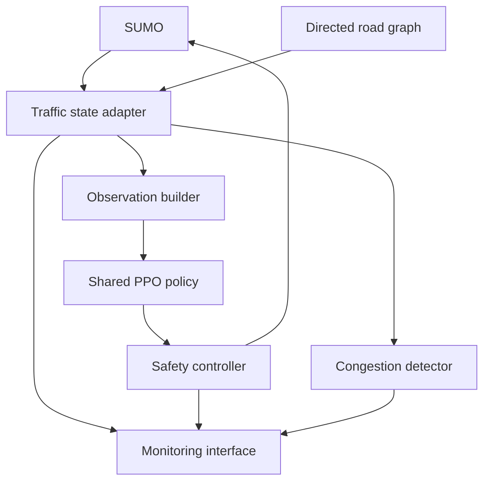

# Traffic Signal AI — V1 Design and Implementation Plan

**Status:** Architecture frozen; implementation and validation pending  
**Working branch:** `feat/traffic-ai`  
**Time budget:** Approximately 12 hours or less  
**Owner:** AI engineering  
**Purpose:** Implement this plan milestone by milestone. Change the architecture only when an implementation problem or experiment justifies it.

> This document describes intended behavior, not completed capabilities or measured results. Numeric defaults below are prototype starting points, not validated real-world signal timings.

## 1. Goal and scope

Build an AI controller that selects traffic signal phases for multiple intersections using current traffic conditions. It should respond to uneven demand and use neighboring traffic information where intersections are connected.

The demonstration includes:
- A SUMO simulation containing connected intersections and an independent intersection.
- A learned traffic controller using a shared PPO policy.
- A monitoring interface showing traffic, signal decisions, and persistent congestion alerts.
- A separate pretrained YOLO vehicle detection and tracking demonstration on real traffic footage.

The V1 policy supports a **standardized family of intersections**. It does not promise to handle arbitrary road layouts or every traffic condition. Adding nodes without changing neural-network dimensions is architectural scalability; good performance on new nodes and demand is an experimental question.

### Frozen decisions

| Component | Decision |
| --- | --- |
| Simulator | SUMO, controlled through Python/TraCI |
| Initial network | Three connected intersections |
| Generalization demonstration | Add an independent standardized intersection; test unseen demand |
| Controller | Parameter-sharing multi-agent PPO |
| Agent | One agent per intersection; all share actor and value-network weights |
| State | Directed road graph plus fixed-size local observations and neighbor summaries |
| Actions | Select one of two compatible green phases |
| Decision cadence | Every 10 simulation seconds |
| Signal execution | Separate deterministic safety controller |
| Training objective | Reduce network delay using queue-based reward and downstream congestion penalty |
| Baselines | Fixed-time and actuated control |
| Anomaly detection | Statistical persistent-congestion detection |
| Perception | Pretrained YOLO and tracking, separate from RL training/evaluation |
| Dashboard | Live state, applied signals, policy requests, metrics, alerts |

### V1 boundaries

Use four approaches per intersection with two green choices: north–south and east–west. Begin with straight-through routes so these phases have an unambiguous conflict map. Turning movements, dedicated turn phases, pedestrian phases, emergency preemption, and irregular geometries require later extensions.

No YOLO training, graph neural network, predictive MPC, or physical signal integration is required for V1. Keep the learned controller as the core implementation.

## 2. Architecture



Real video follows a separate path: **video → pretrained YOLO → tracker → lane-region measurements → annotated demonstration**.

The state adapter is the interface between observations and control. SUMO supplies it during training and evaluation. A future camera adapter should supply equivalent observable fields, with explicit missing-data and confidence handling.

Simulator-derived vehicle bounding boxes are visualization. They are not evidence that image-based detection works.

## 3. Road graph and traffic state

A graph simply records which intersections connect to which other intersections.

- **Node:** An intersection with its approach lanes and phase definitions.
- **Directed edge:** A road carrying traffic from one intersection to another.
- **Edge metadata:** Lane IDs, direction, length, speed limit, and estimated storage capacity.
- **Independent node:** An intersection with no neighboring controlled intersections.
- **Boundary road:** A road entering or leaving the controlled network.

Store this as dictionaries and adjacency lists. A graph library is optional; the graph is connectivity metadata, not a learned model.

Keep an explicit mapping from lane IDs to approach slots and from approach slots to served movements. Never infer signal phase indices from intersection names.

### Approach measurements

Order approach slots consistently as `N, E, S, W`, describing where traffic enters the intersection.

| Field | Meaning | V1 use |
| --- | --- | --- |
| `vehicle_count` | Vehicles currently in the configured incoming lanes | Observation/dashboard |
| `queue_count` | Vehicles moving below 0.1 m/s; a queue proxy, not queue length in meters | Observation/reward |
| `occupancy` | Fraction of lane length occupied by vehicles | Observation/dashboard |
| `arrival_rate_vps` | Vehicles entering the approach measurement region per second over the last 30 s | Observation |
| `mean_wait_s` | Mean current waiting time of vehicles on the approach | Observation/dashboard |
| `mean_speed_mps` | Mean speed of vehicles on the approach | Observation/dashboard |
| `downstream_occupancy` | Occupancy of receiving road lanes | Observation/spillback penalty |
| `storage_capacity` | Configured approximate vehicle storage | Normalization |
| `neighbor_present` | Whether the road connects to another controlled intersection | Observation |
| `measurement_valid` | Whether the field is available and current | Adapter validity checks |

Sum counts across approach lanes; use lane-length weighting for occupancy and vehicle-count weighting for speed/waiting time. For an empty approach, use zero count and wait, and its speed limit as the normalized free-flow speed.

Estimate arrival rate by tracking IDs entering the configured region. Counting IDs newly appearing on an entire lane also counts lane changes: constrain the initial network or filter those changes.

For V1 straight-through traffic, downstream occupancy refers to the receiving lane(s) across the intersection. Boundary exits still have receiving roads. They have no controlled neighbor, but downstream measurements must not automatically be zero.

### Raw state contract

The full state stays readable and carries units. Only the observation builder converts it into the neural-network vector.

```json
{
  "schema_version": "1.0",
  "sim_time_s": 120.0,
  "source": "sumo",
  "intersection_id": "J1",
  "signal": {
    "active_green_phase": 0,
    "transition_state": "green",
    "elapsed_green_s": 20.0
  },
  "approaches": {
    "N": {
      "vehicle_count": 12,
      "queue_count": 8,
      "occupancy": 0.24,
      "arrival_rate_vps": 0.30,
      "mean_wait_s": 18.0,
      "mean_speed_mps": 2.5,
      "downstream_occupancy": 0.40,
      "storage_capacity": 30,
      "measurement_valid": true
    }
  },
  "neighbors": {
    "N": {
      "present": true,
      "intersection_id": "J2",
      "normalized_queue": 0.25,
      "mean_occupancy": 0.30
    }
  }
}
```

This example shows one slot; every complete state contains all four approach and neighbor slots. During a transition, `active_green_phase` identifies the last active green; `transition_state` tells the policy it is not currently green.

## 4. Policy observation and actions

### Fixed-size observation: 44 values

| Block | Contents | Size |
| --- | --- | --- |
| Approaches | Seven normalized measurements per approach, ordered N/E/S/W | 28 |
| Neighbors | Presence, normalized total queue, mean incoming occupancy per directional slot | 12 |
| Signal | Two-value one-hot green phase, elapsed green, transition flag | 4 |
| **Total** | Same layout for every agent | **44** |

The seven approach values are queue count, vehicle count, occupancy, arrival rate, mean wait, mean speed, and downstream occupancy.

Normalize counts by approach storage capacity, speed by speed limit, elapsed green by maximum green, and waiting time by a configurable 120 s reference. Normalize arrival rate by a fixed configured flow reference. Clip neural-network features to `[0, 1]`, while preserving unclipped raw values for reporting.

Normalize neighbor queue by the neighbor's total incoming storage. Aggregate multiple neighbors in one directional slot using a documented mean. For no neighbor, use three zeros. The presence flag distinguishes absence from an empty neighboring intersection.

Do not include vehicle routes, future arrivals, exact intended turns, or future demand in the policy observation. Those would give it information the proposed camera system may not have.

V1 uses valid simulator observations. The validity flags remain in the raw contract; a real camera adapter needs a later missing-data strategy before it can be substituted safely.

### Action contract

- `0`: Request north–south green.
- `1`: Request east–west green.

The policy chooses the phase. Green duration emerges from repeated decisions and safety constraints; V1 does not output a separate continuous duration.

Example request:

```json
{
  "intersection_id": "J1",
  "requested_phase": 1,
  "decision_time_s": 120.0
}
```

## 5. Safety controller

Use prototype defaults of **10 s minimum green, 60 s maximum green, 3 s yellow, and 1 s all-red**. Configure these independently of model weights.

The policy requests a green phase; it never writes arbitrary signal colors.

Rules:
1. Hold the current phase when requested again, unless maximum green requires a switch.
2. Reject an early switch while minimum green has not elapsed.
3. Execute every permitted change as green → yellow → all-red → requested green.
4. Ignore new phase changes during a transition.
5. Enforce maximum green and prevent indefinite starvation.
6. Use a valid fixed-time fallback for missing observations, policy failures, or invalid outputs.

Advance the simulator and safety state machine in 1 s steps. Policy decisions occur every 10 s. Minimum/maximum constraints apply to actual green time, not time since the policy request. A transition between decision ticks can make a later request temporarily ineligible.

Record requested action, applied phase, transition state, and any override reason. Safety behavior must also apply consistently to evaluation baselines.

Use ordinary PPO with this deterministic request-to-execution mapping as part of the environment. Store the **sampled requested action** and its log probability in the rollout; do not replace it with the applied phase when computing PPO loss.

## 6. Shared-policy PPO

Every intersection uses the same neural network but gets its own observation and produces its own action. Neighbor measurements allow connected agents to respond to nearby congestion; independent agents receive absent-neighbor slots.

V1 is **parameter-sharing independent PPO**, with a local observation-based critic and shared team reward. It is not centralized-critic MAPPO, and sharing weights alone does not prove coordination.

### Implementation contract

- One SUMO process owns the complete network and simulation clock.
- At each decision boundary, build an observation for every intersection.
- Run the shared policy over the batch.
- Submit every request before advancing the common simulation.
- Collect the reward over the next 10 s.
- Keep a trajectory per agent; compute returns/advantages along that trajectory.
- Pool trajectories to update the same PPO weights.
- Distinguish episode termination from time-limit truncation when bootstrapping.

Do not advance SUMO once per agent. Agents in the same network must observe and act against a consistent simulation time. Do not treat neighboring agents as separate vector environments that independently step the same process.

Start with a small MLP, two hidden layers of 64 units, a categorical actor, and a value head. Initial tuning values: learning rate `3e-4`, discount `0.99`, GAE lambda `0.95`, PPO clip `0.2`, and entropy coefficient `0.01`. These are starting settings, not evidence of convergence.

A maintained PPO implementation may be reused if its environment/rollout API supports this stepping contract. An episode that runs successfully is only an integration milestone; evaluate the learned policy separately.

### Reward

Use an interval-averaged team reward:

```text
reward = -(mean_normalized_queue + 0.25 * congested_receiving_fraction)
```

- `mean_normalized_queue`: Mean approach queue divided by storage capacity across all controlled intersections.
- `congested_receiving_fraction`: Fraction of receiving road measurements whose occupancy exceeds a starting threshold of 0.80.
- Average both terms over the 10 s simulation interval.
- Give every agent the same team reward.
- Include independent intersections in the team metric, but also report each connected component separately.

Queue is a practical delay proxy, not measured travel delay. Evaluate actual waiting time and time loss after training. If demand cannot enter the network, low internal queues can be misleading: log insertion backlog, depart delay, throughput, and unfinished trips.

## 7. Training scenarios and evaluation

Train headlessly on the three-intersection network. Randomize demand across episodes: balanced flow, directional imbalance, and changes in demand over time. A starting episode is 900 simulation seconds; adjust rollout length based on measured runtime.

Reserve evaluation seeds and demand schedules before training. Never select a checkpoint using the final test results.

### Minimum evaluation set

| Scenario | Question |
| --- | --- |
| Balanced demand | Does it preserve acceptable service on all approaches? |
| Directional imbalance | Does it adapt when one direction becomes busier? |
| Demand shift | Does it react when the busy direction changes mid-run? |
| Downstream bottleneck | Does congestion propagate or recover? |
| Added independent intersection | Can the same weights run without neighbors? |

The added intersection must use the same phase and observation schema. Treat this as a bounded generalization test.

Compare fixed-time, actuated, and PPO control. Use the same network, routes, demand files, horizon, seeds, and applicable safety constraints. Choose baseline settings on training/validation scenarios, rather than intentionally weak test settings.

Use at least three held-out seeds per scenario if time permits. Prefer five; if only one is possible, label the result as a single-run demonstration.

### Metrics

- Mean vehicle time loss and waiting time.
- Throughput: completed trips.
- Mean and peak queue per intersection.
- Tail waiting time and worst-served approach.
- Vehicles remaining at the horizon and demand awaiting insertion.
- Depart delay, blocked roads, and teleport/gridlock events.
- Safety overrides and illegal-transition count.

Completed-trip averages can hide stranded vehicles. Use the same fixed horizon for throughput/unfinished counts, and an identical bounded drain period if collecting completed-trip delay. Include unfinished-trip output and report vehicles that still do not finish.

For lower-is-better metrics:

```text
improvement_percent = 100 * (baseline - PPO) / baseline
```

Do not report a percentage when the baseline is zero. Report degradation and variability as well as improvements. Show network and per-intersection results; a good average can hide a severely neglected approach.

## 8. Persistent congestion alerts

Keep this module separate from PPO. It observes traffic and emits dashboard events; it does not override signals in V1.

Collect a per-intersection reference distribution of normalized queue under ordinary validation demand. Freeze the reference before the congestion demonstration.

Starting trigger:
- Current queue is above the reference 95th percentile.
- Normalized queue also exceeds 0.50.
- Both conditions persist for 30 s.

Clear after 30 s below the trigger and suppress duplicate events while an alert is active. Make thresholds configurable; these defaults need calibration.

Alert payload: event ID, intersection ID, simulation time, severity, observed queue, reference threshold, duration, and status.

Call it a **persistent-congestion alert**, not a proven accident detector. Traffic alone cannot establish the cause. A sustained injected demand spike or bottleneck is enough to demonstrate the alert.

Authority notification in V1 means an event displayed in the monitoring interface. No real messages or external authority integrations are implemented.

## 9. Dashboard interface

Publish one backend snapshot per simulated second, preferably through a simple polling endpoint. Include:

- Simulation run ID, time, scenario, controller name, and paused/running status.
- Intersections and road connections.
- Raw approach measurements.
- Requested action, applied green/transition, elapsed green, override reason.
- Aggregate and per-intersection metrics.
- Active and resolved congestion alerts.

The dashboard reads backend state; it must not maintain a separate copy of traffic-control logic. A scenario change resets the simulator, controller state, rolling measurement windows, and alert history for that run.

PPO and baseline comparisons are separate identical-demand runs. Label whether the interface shows a live run or recorded evaluation results.

## 10. Separate YOLO demonstration

1. Select a short, usable traffic video.
2. Run pretrained YOLO and retain relevant vehicle classes.
3. Attach a tracker and display track IDs.
4. Configure lane/approach polygons manually.
5. Assign a vehicle using a consistent ground-contact point, such as the bottom-center of its box.
6. Display bounding boxes, track IDs, and counts by region.

Counts come first. Pixel displacement does not establish speed in m/s without scene calibration. Queue and wait estimates require tracking, a stationary threshold, stable timestamps, and handling of occlusion. Mark unsupported fields unavailable; do not invent them.

Keep camera output separate from SUMO controller observations in V1. Integrating an arbitrary real video into a simulator with unrelated vehicles would not validate the control loop.

Say **“implemented a pretrained YOLO-based perception pipeline”** unless custom training actually occurs. Full deployment also requires camera validation, sim-to-real evaluation, signal-controller integration, pedestrian/conflict handling, and operational approval.

## 11. Project organization

The authoritative folder layout and file responsibilities are defined in
[PROJECT_STRUCTURE.md](PROJECT_STRUCTURE.md).

Use native Windows Python and SUMO.

Configuration-driven scripts accept a `--config` argument with a documented
default. Initial project configurations use JSON.

Command-line entry points belong in `scripts/`. Reusable implementation belongs
in `src/`. Create modules as their implementation milestones begin.

The project structure document governs file organization. This design document
governs architecture, data contracts, controller behavior, and evaluation.

## 12. Implementation checklist

Time blocks are approximate **elapsed budget**, not guaranteed training times. Dashboard work can proceed independently once telemetry is agreed.

### Milestone 1 — Running network and state (hours 0–2)

- [ ] Create three connected standardized intersections and legal phase programs.
- [ ] Generate balanced and imbalanced demand files.
- [ ] Run one complete headless episode.
- [ ] Define lane/phase/connectivity mappings.
- [ ] Extract raw state and build finite 44-value observations.
- [ ] Confirm all directions, units, and absent-neighbor slots.

**Done when:** Every intersection produces valid state throughout an episode without crashes.

### Milestone 2 — Safe execution and baselines (hours 2–3.5)

- [ ] Implement 1 s safety stepping and 10 s policy requests.
- [ ] Verify minimum green, yellow/all-red, maximum green, and fallback.
- [ ] Log requested versus applied actions.
- [ ] Run fixed-time and actuated controllers.
- [ ] Save evaluation metrics using a common runner.

**Done when:** Both baselines complete the same scenario and signal transitions are legal.

### Milestone 3 — PPO training (hours 3.5–7)

- [ ] Implement synchronous multi-intersection stepping.
- [ ] Store separate agent trajectories and pooled updates.
- [ ] Run one complete rollout and PPO update.
- [ ] Randomize training demand and save checkpoints/configuration/seeds.
- [ ] Measure rollout throughput and review queue, reward, and action trends.
- [ ] Check that changing traffic observations can change policy behavior.

**Done when:** Training and checkpoint reload work. Performance remains unproven until evaluation.

### Milestone 4 — Evaluation (hours 7–9)

- [ ] Evaluate the same checkpoint against both baselines on held-out demand.
- [ ] Run demand shift and bottleneck scenarios.
- [ ] Add an independent standardized intersection without retraining.
- [ ] Save per-seed results, unfinished demand, and safety statistics.
- [ ] Record where PPO improves and where it fails.

**Done when:** Reproducible comparison files exist; no improvement claim depends only on training reward.

### Milestone 5 — Monitoring and alert demonstration (hours 9–10.5)

- [ ] Publish the agreed telemetry snapshot.
- [ ] Connect the dashboard to actual simulator state.
- [ ] Calibrate the reference congestion distribution.
- [ ] Demonstrate a persistent alert and its resolution.

**Done when:** Signals, metrics, and alert timing match backend records.

### Milestone 6 — Perception and presentation (hours 10.5–12)

- [ ] Run pretrained YOLO and tracking on real footage.
- [ ] Add region counts and record a short annotated clip.
- [ ] Prepare simulation comparison and alert demonstration.
- [ ] Document completed capabilities, results, and remaining deployment work.

**Done when:** Every capability claimed in the presentation has a working demonstration or recorded evidence.

## 13. Failure handling and final acceptance

If training is slow, simplify demand and reduce episode length before adding complexity. Keep the standardized network and shared-policy design. If PPO does not outperform baselines, report that honestly and demonstrate the best evaluated controller with its actual label. Do not present a baseline as the trained AI.

V1 is implementation-complete when:
- Multiple connected and independent intersections use the common schema.
- A saved shared PPO policy can control every standardized intersection.
- All applied transitions pass the safety checks.
- Held-out baseline comparisons are reproducible.
- Monitoring shows actual state and congestion events.
- Real footage demonstrates pretrained detection/tracking and region counts.
- Performance and generalization claims stay within the measured scenarios.

**Performance success is separate:** It requires meaningful held-out improvement without unacceptable starvation, unfinished-demand growth, or safety violations.

## 14. Implementation references

Use official documentation for API details. Pin installed simulator and ML dependency versions in the project.

- [SUMO lane value retrieval](https://sumo.dlr.de/docs/TraCI/Lane_Value_Retrieval.html): vehicle count, mean speed, occupancy, waiting time, and halting count.
- [SUMO traffic-light control](https://sumo.dlr.de/docs/Simulation/Traffic_Lights.html): phase programs and signal control.
- [SUMO TripInfo](https://sumo.dlr.de/docs/Simulation/Output/TripInfo.html): waiting time, time loss, depart delay, and unfinished-trip reporting.

The architecture, observation layout, reward, and numeric defaults above are project design choices. The references describe simulator capabilities; they do not establish that this controller is effective.

